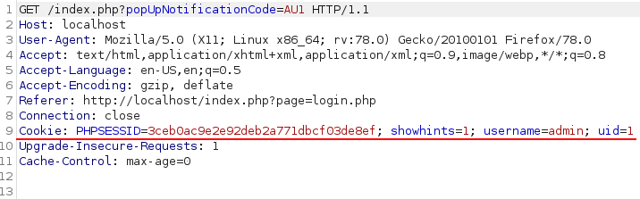
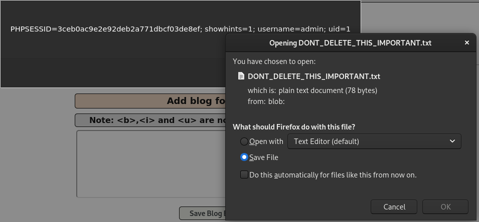

# Zagadnienia prezentowane przed nami
1. SQLI
1. CSRF
1. Server Side Template Injection
1. SSRF

# ASVS 4
Link do GitHub'a:
[github.com/OWASP/ASVS](https://github.com/OWASP/ASVS/blob/v4.0.3/4.0/docs_en/OWASP%20Application%20Security%20Verification%20Standard%204.0.3-en.csv)
# CVSS

# Lab
### Spis treści
1. Lab0: Adding user, login, password policies. ASVS.
1. Lab1: Session Hijacking
1. Lab2: Cross Site Scripting (XSS)
1. Lab3: Insecure Direct Object Reference (IDOR)

### Instalacja maszyny
```bash
git clone https://github.com/webpwnized/mutillidae-docker
cd mutillidae-docker
docker-compose up
```

Jeśli wystąpią problemy:
1. Doinstaluj docker-compose  `sudo apt install docker-compose`.
1. Dodaj siebie do grupy `docker`. `sudo usermod -aG docker $USER`.
1. Opcjonalnie zrestartuj serwis `sudo service docker restart`.
1. Uruchom dockera z pozycji roota `sudo docker-compose up`.

Kod źródłowy każdej strony możesz podejrzeć na `http://127.0.0.1/index.php?page=source-viewer.php`

### Lab 0 Przykład pracy z ASVS
1. Sprawdź czy możesz stworzyć użytkownika, którego hasło posiada mniej niż 12 znaków.  
Zapisz numer ASVS, oceń poziom ryzyka (Możesz zrobić to sam lub skorzystać z przykładowego rozwiązania zaprezentowanego w prezentacji). Na koniec zasugeruj rozwiązanie problemu.  

1. Spróbuj zmienić hasło użytkownika. Sprawdź czy wymagana jest znajomość starego hasła. Zapisz numer ASVS, oceń poziom ryzyka oraz zasugeruj rozwiązanie problemu.

1. Wykorzystaj tabelę niżej i spróbuj zidentyfikować pozostałe (o ile istnieją) wady.

1. Wycinek tabeli do pomocy

| # | Description | CWE | NIST |
| --- | --- | --- | --- |
| V2.1.1 | Verify that user set passwords are at least 12 characters in length (after multiple spaces are combined). ([C6](https://owasp.org/www-project-proactive-controls/#div-numbering)) | 521 | 5.1.1.2 |
| V2.1.2 | Verify that passwords of at least 64 characters are permitted, and that passwords of more than 128 characters are denied. ([C6](https://owasp.org/www-project-proactive-controls/#div-numbering)) | 521 | 5.1.1.2 |
| V2.1.3 | Verify that password truncation is not performed. However, consecutive multiple spaces may be replaced by a single space. ([C6](https://owasp.org/www-project-proactive-controls/#div-numbering)) | 521 | 5.1.1.2 |
| V2.1.4 | Verify that any printable Unicode character, including language neutral characters such as spaces and Emojis are permitted in passwords. | 521 | 5.1.1.2 |
| V2.1.5 | Verify users can change their password. | 620 | 5.1.1.2 |
| V2.1.6 | Verify that password change functionality requires the user's current and new password.  | 620| 5.1.1.2 |

Przypomnienie: Prowadź tabelę w której będziesz wszystko zapisywał.


### Lab 1 - Session Hijacking 
1. Wykorzystując wiedzę o pliku robots.txt odszukaj lokalizację na stronie gdzie mogę być przechowane hasła użytkowników.  
    <details>
    <summary>Podpowiedź 1 (rozwiń)</summary>
    1. W adresie url <code>http://localhost/index.php?page=robots-txt.php</code> podmień zawartość <code>page</code> na <code>robots.txt</code>. (<code>http://localhost/index.php?page=robots.txt</code>)
    </details>
    <details>
    <summary>Podpowiedź 2 (rozwiń)</summary>
    1. Przekieruj się na adres <code>http://localhost/passwords/</code>
    </details>
1. Zapisz dane logowania dowolnego użytkownika.
1. Oczywiście sposobów wydobycia ciasteczka sesji jest wiele (prezentacja). Stworzymy prosty scenariusz w celu którego wykorzystamy narzędzie BURP SUITE. Zaloguj się na wybranego użytkownika. Włącz przechwytywnie zapytania. Odśwież stronę.
1. Zapisz ciasteczko sesji w osobnym pliku.

1. Wyłącz przechwytywanie. Wyloguj się z aktualnego użytkownika i zaloguj się na innego lub stwórz własne konto.
1. Włącz przechwytywanie. Odśwież stronę i przejdź do BURP SUITE.
1. Podmień wartość `Cookie` na skopiowaną wartość wcześniejszego użytkownika. Naciśnij `Forward`.
1. Właśnie zostałeś uwierzytelniony jako drugi użytkownik. Jednak po przejściu na dowolną inną stronę otrzymujemy zresetowane ciasteczko użytkownika, na którego się logowaliśmy. Jeśli chcemy używać danej sesji podczas wykonywania ataków należy użyć opcji `Process cookies in redirections`.
1. Stwórz tabelę oceny zagrożenia.

### Lab 2 - Cross Site Scripting (XSS)
W tej częsci postaramy się wykraść od użytkowników przeglądających blog ich ciasteczka sesji, żeby móc wykorzystać je tak jak w labie wcześniejszym.  

#### Persistent
1. Zaloguj się na dowolnego użytkownika i przejdź na stronę `http://localhost/index.php?page=view-someones-blog.php`.  
lub OWASP 2017 -> A7 - Cross Site Scripting (XSS) -> Persistent (Second order) -> Add to your blog.  
1. Dla sprawdzenia czy podatność istnieje wykorzystamy najprostszy payload. Wpisz w polu wpisywania: `<script>alert(document.cookie)</script>`.  
Wyślij treść bloga na serwer. Od razu pojawia się alert w którym są informacje z aktualnej sesji. Podatność istnieje - wykorzystajmy ją.
1. Do zaprezentowania ideii wstrzykniemy kod, który zaproponuje odwiedzającemu zapisanie pewnego pliku. Jego zawartością będzie ciasteczko z sesją.
1. Na zalogowanym użytkowniku proszę wprowadzić zapis o treści:  
    ```js
    var a = document.createElement("a");
    a.href = window.URL.createObjectURL(new Blob([document.cookie], {type: "text/plain"}));
    a.download="DONT_DELETE_THIS_IMPORTANT.txt";
    a.click();
    ```
1. Zauważ, że treścią która zostanie wpisana do pliku *.txt będzie wartość `document.cookie`. Pamiętaj, żeby owinąć całość odpowiednim tagiem!
1. Po zapisaniu bloga. Wyloguj się z aktualnego użytkownika i zaloguj na innego. Wejdź na stronę `http://localhost/index.php?page=view-someones-blog.php`.  
lub OWASP 2017 -> A7 - Cross Site Scripting (XSS) -> Persistent (Second order) -> View someone's blog.  
1. Wyszukaj blogi wcześniejszego użytkownika.
1. And voilà!

Oczywiście prawdopodobieństwo, że ktoś zostawi taki plik na publicznym komputerze w firmie po pobraniu jest małe - jednak ciągle niezerowe...
1. Zapisz zgodnie z wytycznymi wpis w tabeli oceny ryzyka. Weź pod uwagę, że każda strona wyciągająca zainfekowany rekord z bazy danych wywoła znajdujący się tam skrypt.

#### Reflected
Działa tak samo jak Persistent tylko jednorazowo na daną stronę. (prezentacja)
Jak myślisz dlaczego przeglądarka dopuszcza do wykonywania takiego kodu? Zwiększ poziom bezpieczeństwa na poziom `5`. Spróbuj wpisać prosty skrypt.

#### DOM-based XSS
1. Wejdź na stronę `http://127.0.0.1/index.php?page=html5-storage.php`  
lub OWASP 2017 -> A7 - Cross Site Scripting (XSS) -> DOM-Based -> HTML5-web-storage. 
1. Zapoznaj się z poniższym fragmentem kodu, który jest wywoływany gdy wpisywanyjest klucz i wartość na stronie.

```js
var setMessage = function(/* String */ pMessage){
		var lMessageSpan = document.getElementById("idAddItemMessageSpan");
		lMessageSpan.innerHTML = pMessage;
		lMessageSpan.setAttribute("class","success-message");
	};// end function setMessage
```  
Podpowiedź: Zobacz jak działa metoda `innerHTML`

1. Spróbuj wpisać payload z alertem w javascript `<script>alert(1)</script>`. Czy wpisany kod działa?
1. Wykorzystamy inny element DOM np. znacznik ``. Proszę wpisać w polu wartość `"`
1. Od razu po wysłaniu wykonuje się kod z JS, który był ukryty wewnątrz tagu ``.
1. Uzupełnij tabelę o nową podatność. Opisz ją.


### Lab 3 - Insecure Direct Object Reference (IDOR)
1. Webshell
1. `& ls /` on DNSlookup site


# Tabela raportu
1. W ramach ćwiczeń uczestnicy opiszą sposób wywołania, działania i potencjalnego załatania podatności.