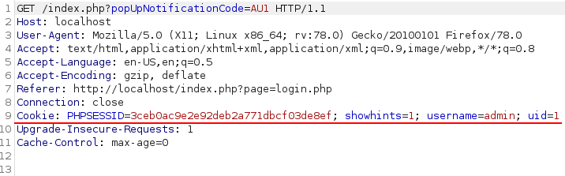

# Zagadnienia prezentowane przed nami
1. SQLI
1. CSRF
1. Server Side Template Injection
1. SSRF

# ASVS 4
Link do GitHub'a:
[github.com/OWASP/ASVS](https://github.com/OWASP/ASVS/blob/v4.0.3/4.0/docs_en/OWASP%20Application%20Security%20Verification%20Standard%204.0.3-en.csv)

# Lab
### Spis treści
1. Lab0: Adding user, login, password policies
1. Lab1: 17.A7 Cookie injection
1. Lab2: 17.A7 Persistent - Add to blog
1. Lab3: #TODO

### Lab 0 Przykład pracy z ASVS
1. Sprawdź czy możesz stworzyć użytkownika, którego hasło posiada mniej niż 12 znaków.  
Zapisz numer ASVS, oceń poziom ryzyka (Możesz zrobić to sam lub skorzystać z przykładowego rozwiązania zaprezentowanego w prezentacji). Na koniec zasugeruj rozwiązanie problemu.  

1. Spróbuj zmienić hasło użytkownika. Sprawdź czy wymagana jest znajomość starego hasła. Zapisz numer ASVS, oceń poziom ryzyka oraz zasugeruj rozwiązanie problemu.

1. Wykorzystaj tabelę niżej i spróbuj zidentyfikować pozostałe (o ile istnieją) wady.

1. Wycinek tabeli do pomocy

| # | Description | CWE | NIST |
| --- | --- | --- | --- |
| V2.1.1 | Verify that user set passwords are at least 12 characters in length (after multiple spaces are combined). ([C6](https://owasp.org/www-project-proactive-controls/#div-numbering)) | 521 | 5.1.1.2 |
| V2.1.2 | Verify that passwords of at least 64 characters are permitted, and that passwords of more than 128 characters are denied. ([C6](https://owasp.org/www-project-proactive-controls/#div-numbering)) | 521 | 5.1.1.2 |
| V2.1.3 | Verify that password truncation is not performed. However, consecutive multiple spaces may be replaced by a single space. ([C6](https://owasp.org/www-project-proactive-controls/#div-numbering)) | 521 | 5.1.1.2 |
| V2.1.4 | Verify that any printable Unicode character, including language neutral characters such as spaces and Emojis are permitted in passwords. | 521 | 5.1.1.2 |
| V2.1.5 | Verify users can change their password. | 620 | 5.1.1.2 |
| V2.1.6 | Verify that password change functionality requires the user's current and new password.  | 620| 5.1.1.2 |

1. Przypomnienie: Prowadź tabelę w której będziesz wszystko zapisywał.

### Lab 1 - Session Hijacking 
1. Wykorzystując wiedzę o pliku robots.txt odszukaj lokalizację na stronie gdzie mogę być przechowane hasła użytkowników.
    <sumary>Podpowiedź 1 (rozwiń)</sumary>
    

        1. W adresie url `http://localhost/index.php?page=robots-txt.php` podmień wartość `page` na `robots.txt`.
        2. http://localhost/index.php?page=robots.txt
    

    <sumary>Podpowiedź 2 (rozwiń)</sumary>
    

        1. Przekieruj się na adres `http://localhost/passwords/`
    

1. Zapisz dane logowania dowolnego użytkownika.
1. Oczywiście sposobów wydobycia ciasteczka sesji jest wiele (prezentacja). Wykorzystamy do tego narzędzie BURP SUITE.
1. Zaloguj się na wybranego użytkownika. Włącz przechwytywnie zapytania. Odśwież stronę.
1. Zapisz ciasteczko sesji w osobnym pliku.

# Tabela raportu
1. W ramach ćwiczeń uczestnicy opiszą sposób wywołania, działania i potencjalnego załatania podatności. My zrobimy na zajęciach 1 przykład.